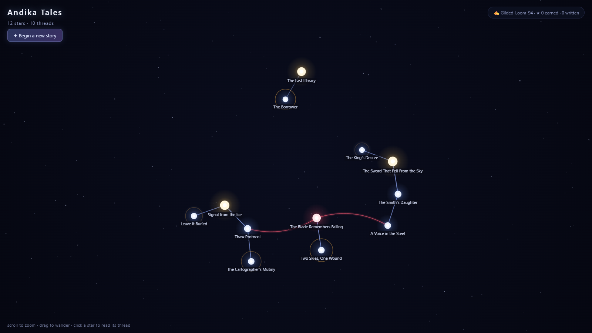
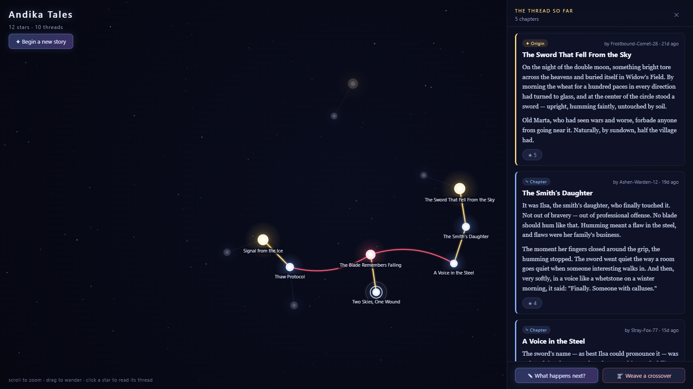
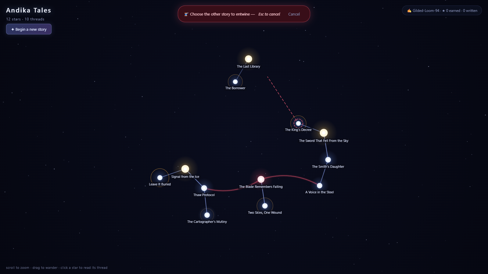
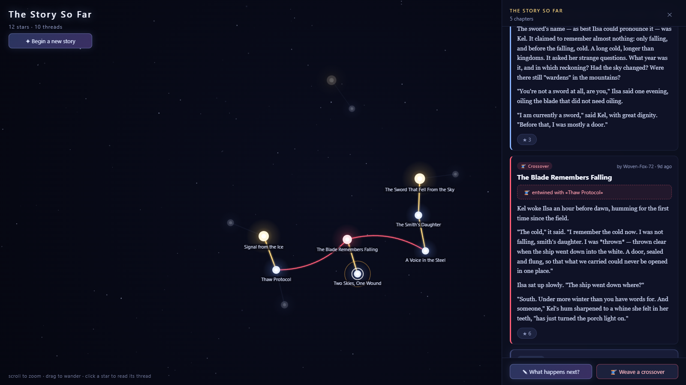
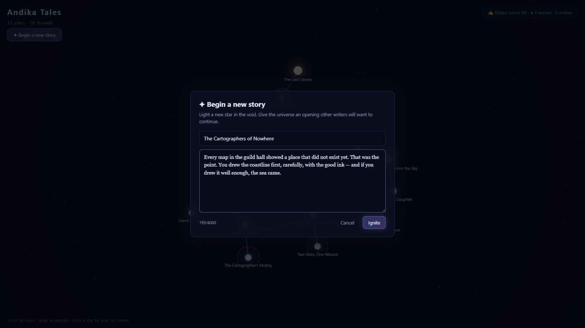

<h1 align="center">✦ Andika Tales</h1>

<p align="center">
  <em>A massively multiplayer universe of branching stories.</em><br>
  Every prompt is a star. Every continuation is a branch.<br>
  And when two strangers' stories turn out to be the same story, a red string pulls them together.
</p>



---

## The idea

Someone writes an opening. A sword falls out of the sky into a medieval wheat field, and it is humming.

Someone else — a stranger, anonymous, three timezones away — reads it and writes what happens next. Then a third person reads the *same* opening and writes something completely different, and the timeline forks. Both are true now. Both keep growing.

Somewhere else entirely, an unrelated story about a spacecraft buried under Antarctic ice has been branching for weeks. Nobody planned for these to be connected.

Then a fourth writer notices something, selects a node from each, and writes the chapter where the sword remembers falling — *thrown clear when the ship went down into the white*. A red string snaps across the void, and two separate stories become one shared universe.

That's the whole game. There are no levels, no assets, no procedural terrain. Just writing, and the enormous, glowing, tangled web it grows into.

## Anatomy of a star

Every piece of writing is a **node**: a short title, a block of story, and an anonymous author. What kind of node it is depends only on how many parents it has.

| | Kind | Parents | What it means |
|---|---|---|---|
| 🟡 | **Genesis** | none | A new story, burning alone in the dark |
| 🔵 | **Continuation** | one | The next chapter. Several on one parent = the timeline forks |
| 🔴 | **Crossover** | two | The red string. Two unrelated timelines become one universe |

Brighter, fatter threads mean well-starred paths. Bigger stars mean more loved chapters.

## Trace any thread back to its beginning

Click any star and the constellation dims — except the exact path back to the story's origin, which lights up gold. The panel beside it reads that lineage in order, from the first line ever written to the moment you clicked on.



You are never lost in the web. Every node knows where it came from.

## Pull the red string

Reading a chapter and realising it belongs with something else entirely? Hit **Weave a crossover**, and a thread follows your cursor across the void until you choose the other star.



Crossovers can only bind timelines that are genuinely separate. Try to entwine a story with its own ancestor and the universe politely refuses — that's just a continuation wearing a costume.

Once woven, the crossover chapter carries the seam forever, and you can step sideways into the other story from inside the thread you were reading:



## Light a new star

Or start something nobody has touched yet.



Stories that go too long without a continuation start to pulse amber in the constellation — unfinished threads, quietly asking to be picked up.

---

## Quickstart

Requires **Node 20 or newer**.

```bash
npm install
npm run seed   # optional — seeds a small demo universe (wipes existing data)
npm run dev    # web on :5173, API on :3001
```

Open <http://localhost:5173>. Anyone on your network can join at your machine's IP — the constellation updates live for everyone at once, no refresh.

There is no signup. On first visit you're minted an anonymous handle like `Woven-Fox-72` and a secret token, kept in your browser.

## How it works

**The graph is a DAG, not a tree.** Nodes and parent links live in SQLite; a node's kind is derived from its parent count, so crossovers aren't a special case bolted on — they're just a node with two parents. Lineage and ancestry are recursive CTEs, which is why tracing a thread back through thousands of nodes is instant.

**The constellation is hand-rolled canvas** over a [d3-force](https://d3js.org/d3-force) simulation: glow gradients, camera pan/zoom that keeps the point under your cursor pinned while you scroll, label decluttering by zoom level, and a starfield that parallaxes against the story graph. The camera fits the whole universe on load, then gets out of your way the moment you touch it.

**Everything is live.** New nodes and votes fan out over a WebSocket to every connected player, so branches appear in your sky as other people write them.

Two knobs, both environment variables on the server: `API_PORT` (default `3001`) and `STALE_MS` — how long a leaf sits unwritten before it starts glowing for attention (default 3 days).

## The shape of the code

```
server/src/
  db.ts       schema, domain rules, graph queries (lineage, ancestry, votes)
  index.ts    HTTP routes + WebSocket broadcast
  seed.ts     the demo universe
  handles.ts  anonymous handle generator
client/src/
  graph/ConstellationCanvas.tsx   the renderer — physics, camera, glow, tracing
  components/                     reader panel, composer, node form
  api.ts / ws.ts                  fetch client, auto-reconnecting socket
```

## Where it's going

Nowhere in particular — this started as an experiment. If it ever grows up: moderation tooling, discovery feeds for the hottest threads and loneliest stars, and Postgres when it outgrows a single file.

## License

[MIT](LICENSE) — do what you like with it, just keep the copyright notice.
